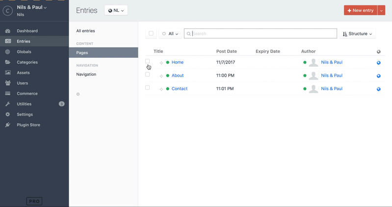

# Sequential Edit plugin for Craft CMS 3.x

This plugin lets you edit multiple elements (entries, categories, assets (if Craft >= 3.4), Commerce products, Commerce subscriptions and Solspace Calendar Events) in sequence, without being sent back to the index page each time you save your changes.

## Requirements

This plugin requires Craft CMS 3.0.0 or later.

## Installation

To install the plugin, follow these instructions.

1. Open your terminal and go to your Craft project:

        cd /path/to/project

2. Then tell Composer to load the plugin:

        composer require nilsenpaul/craft-sequentialedit

3. In the Control Panel, go to Settings → Plugins and click the “Install” button for Sequential Edit.

## Configuring Sequential Edit

Use the plugin settings page to choose the element types you want to be able to sequentially edit, and save.

## Using Sequential Edit

On the overview page of every (selected) element type (entries, categories, users, Commerce products, Commerce subscriptions or Solspace Calendar events), you can now select all elements you wish to edit, and select 'Edit in sequence' from the action dropdown. Now, if you hit the save button after editing, Sequential Edit will redirect you to the next element in your editing queue. This WILL save you time.

Brought to you by [Paul Verheul](https://nilsenpaul.nl)

Thanks to [nystudio107](https://github.com/nystudio107) for plugin scaffolding and various blog posts!
